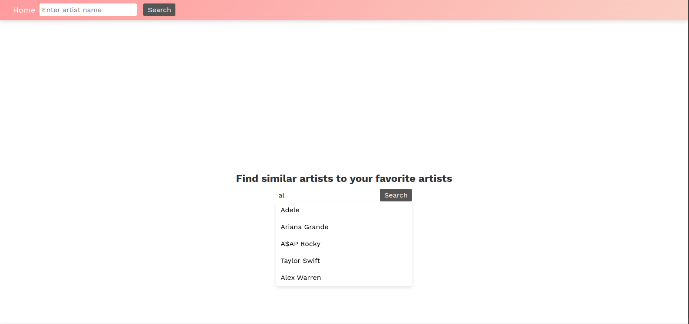
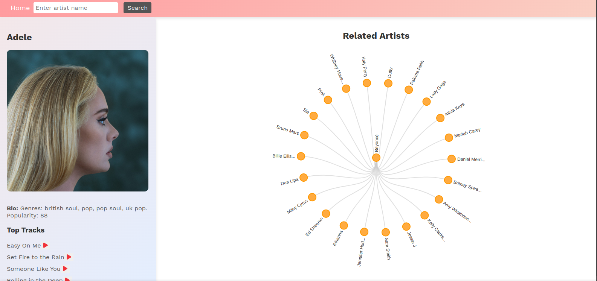
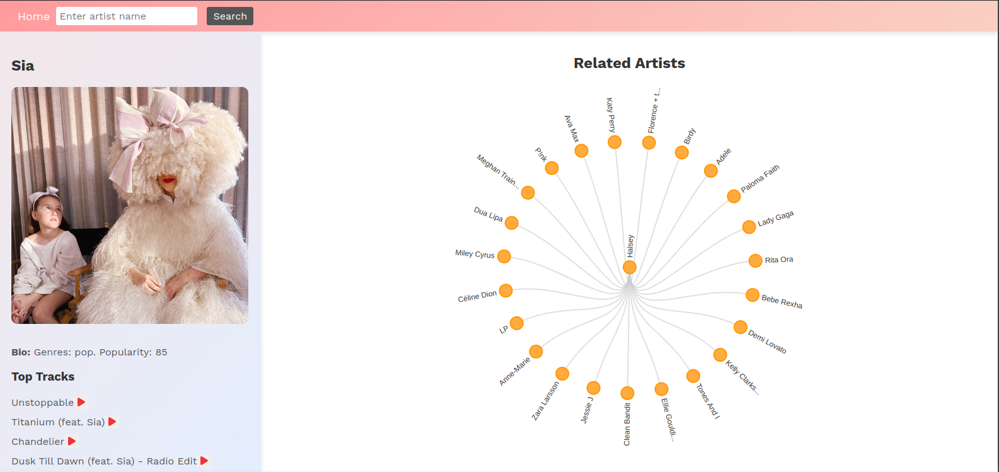

## Buzzd

**Buzzd is a web app that allows you to discover new artists and some of
their top tracks**

## Technologies

- Fronted
The project uses React JS
It uses D3.js for visualization

- Backend
The project uses Flask to interact with APIs (Spotify and Lastfm)

## How to use Buzzd

## 1. Search for and artist

For example, Adele

The app will display Adele's bio, top tracks, and related artists

## 2. Find more artists

You can then click on either of the artists for more recommendations.
For example, if you click Sia, you get the following:

Enjoy!!!
